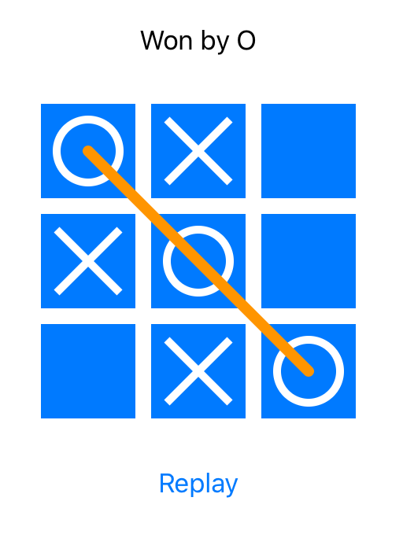

# SwiftUI Games

Some games build using SwiftUI.

## Getting Started

These instructions will get you a copy of the project up and running on your local machine for development and testing purposes. See deployment for notes on how to deploy the project on a live system.

### Prerequisite

Download Xcode 11 (beta) from http://developer.apple.com/

## Games

### Snake

### Tic tac toe

## Lines

## Tetris

## Author

**Berik Visschers**

## License

This project is licensed under the MIT License - see the [License](LICENSE.md) file for details

