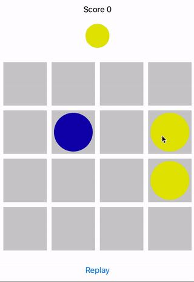

# SwiftUI Games

Some games build using SwiftUI.

## Prerequisite

Download Xcode 11 beta 2 from https://developer.apple.com/download/.
To run on device, you need to install iOS 13 beta from https://developer.apple.com/download/.

## Games

### Snake

### Tic tac toe

## Lines

## Tetris

## Mine sweeper

## Author

**Berik Visschers**

## License

This project is licensed under the MIT License - see the [License](LICENSE.md) file for details

